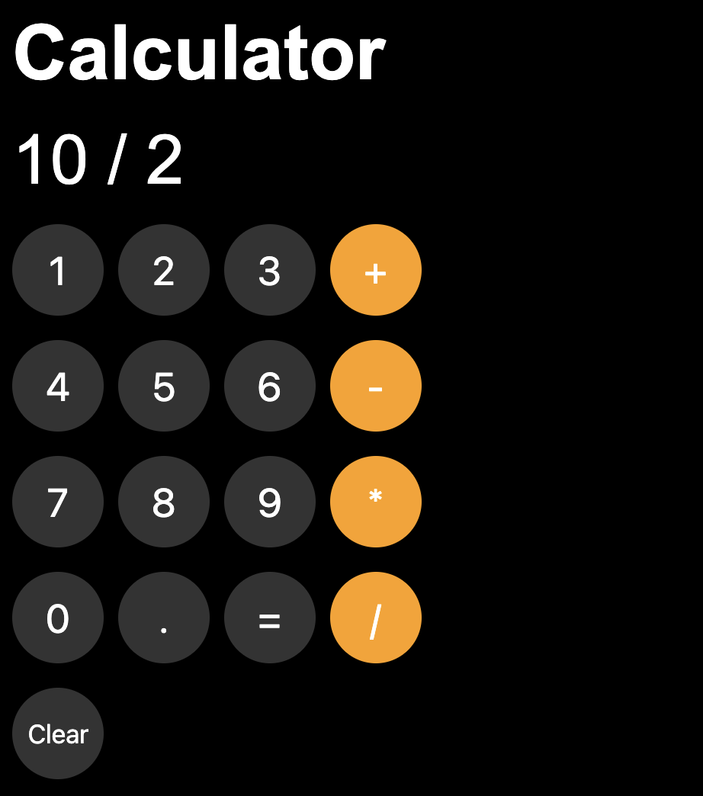

# 🧮 Basic Calculator  
A simple browser-based calculator that supports addition, subtraction, multiplication, division, and clearing inputs. Built using HTML, CSS, and JavaScript.


---

## 📌 Overview
This project is a basic calculator application that allows users to perform simple arithmetic operations directly in the browser. The interface includes number buttons, operator buttons, an equal button to compute results, and a clear button to reset the current operation.

---

## ✨ Features
- Add, subtract, multiply, and divide  
- Clear the current operation and results  
- Real-time display updates  
- Simple and intuitive user interface  

---

## 🛠️ Technologies Used
- **HTML5** for structure  
- **CSS3** for styling  
- **JavaScript** for calculator logic  

---

## 📂 Project Structure
```
/
├── index.html # Main calculator interface
├── css/
│ └── styles.css # Styling for layout and buttons
├── js/
│ └── script.js # Calculator logic
└── README.md
```

---

## 🧠 How It Works
- Each button click updates the calculator display.
- JavaScript functions handle:
  - Capturing user input  
  - Storing the first number, operator, and second number  
  - Performing the selected operation  
  - Showing the result  
- The **Clear** button resets:
  - The display  
  - Stored values  
  - Ongoing operations  

---

## ➕ Live Demo

Experience the game live: [Rock, Paper, Scissors Game](https://sovilleda07.github.io/calculator)

---

## ▶️ How to Run

To run this project locally:

 1. Clone the repository: 

```bash
  git clone https://github.com/sovilleda07/https://github.com/sovilleda07/calculator.git
```

 2. Navigate to the project directory: 

```bash
  cd calculator
```

 3. Open `index.html` in your preferred web browser 

---

## 📜 License
This project is free for personal or educational use.  
